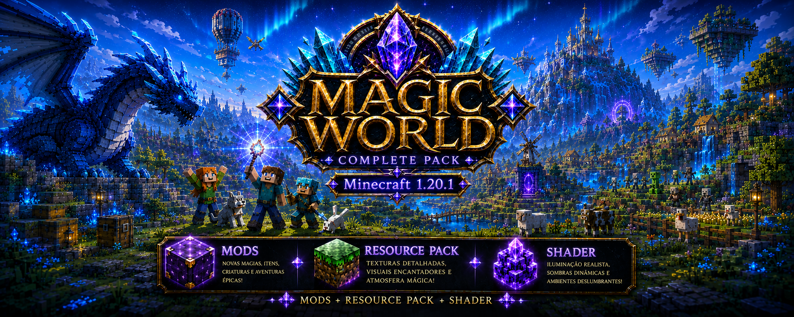
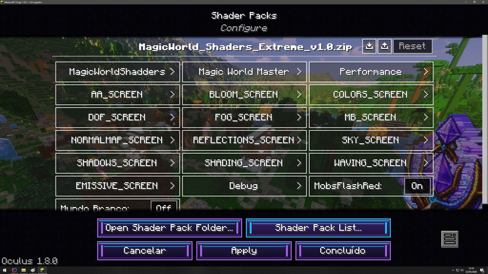
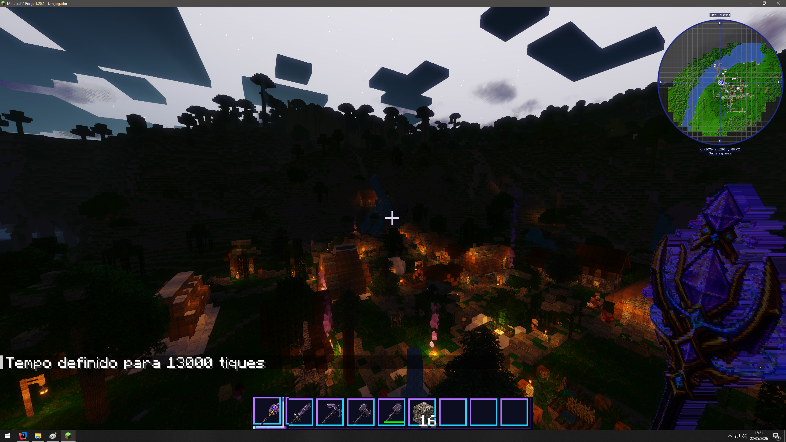
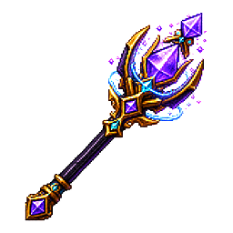
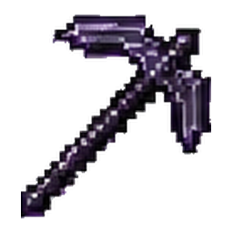
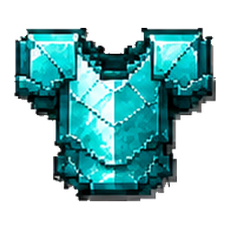
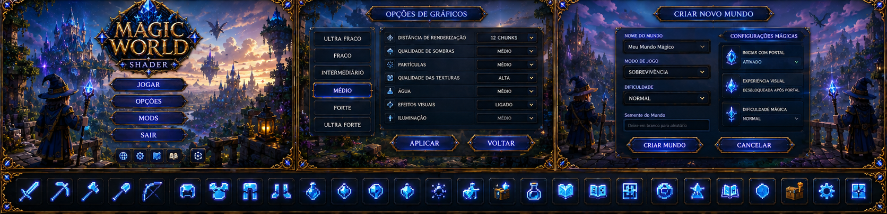
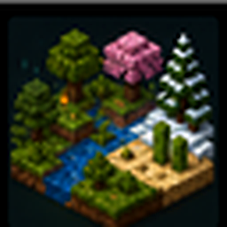
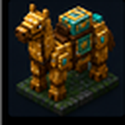
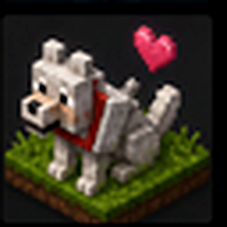

# Magic World Ultimate - Forge 1.20.1

<p align="center">
  
</p>

<p align="center">
  <strong>Um mundo de fantasia magica medieval para Minecraft Java 1.20.1 com Forge.</strong><br>
  <strong>Mod + Resource Pack + Shader Pack em uma experiencia unica.</strong>
</p>

<p align="center">
  
  
  
  
</p>

## O que e o Magic World Ultimate

Magic World Ultimate transforma o Minecraft em uma aventura de fantasia magica. O jogador recebe uma varinha, menus especiais, poderes, estruturas, portais, fazendas, castelo, santuarios, personagens, areas tematicas e um visual criado para funcionar junto com resource pack e shader.

Esta versao e o port final para **Minecraft Forge 1.20.1**. Ela nasceu do projeto NeoForge, mas foi adaptada para a base Forge antiga, com APIs, menus, mixins, estruturas e geracao de mundo ajustados para `Forge 47.4.10`.

A experiencia completa tem tres partes:

| Parte | Funcao | Resultado |
| --- | --- | --- |
| Magic World Mod | Varinha, menus, estruturas, comandos, entidades, sistemas premium e propriedade inicial. | O mundo reage a magia do jogador. |
| MagicWorld 256x Resource Pack | Texturas, modelos, blocos, itens, UI, panorama e identidade visual. | O Minecraft ganha aparencia de fantasia medieval premium. |
| MagicWorld Shadders Extreme | Luz, ceu, agua, sombras, bloom e atmosfera. | A aventura fica cinematografica e encantada. |

## Historia da aventura

Em uma noite calma, quando as montanhas ainda estavam cobertas por neblina e as florestas pareciam dormir, uma luz azul apareceu sobre o mundo. Ela nao caiu como meteoro. Ela desceu devagar, como se escolhesse onde pousar. Quando tocou a grama, abriu um circulo de energia e revelou o primeiro sinal do Magic World.

A partir desse ponto, o mundo comum deixou de ser apenas sobrevivencia. A varinha magica acordou, os portais antigos voltaram a pulsar, as estradas ganharam destino e uma propriedade inteira passou a surgir ao redor do jogador. A casa principal se tornou o ponto seguro. O castelo apareceu como fortaleza distante. As fazendas ganharam trabalhadores. A mina recebeu tesouros e escadas. O fim da rua deixou de ser vazio e passou a guardar novas construcoes.

No final da estrada existe uma casa nova, colocada como marco de chegada para quem segue o caminho ate o ultimo bloco da rua. Perto dali, o santuario magico fica escondido na direcao do morro, como uma caverna ritual iluminada, criada para parecer descoberta e nao apenas colocada no terreno. A entrada mira de volta para a casa principal, como se o santuario protegesse o coracao da propriedade.

Na mata, a casa das bruxas guarda uma historia propria. Ela nao e um lugar de inimigos. E um refugio antigo, pequeno, fechado por cerca, com portao, placa de aviso, teias, morcegos, caldeiroes, lareira, chamine, feno, aboboras iluminadas, camas e baus de pocoes e itens magicos. Tres bruxas vivem ali como aliadas do jogador. Quando o jogador chega perto, elas nao atacam: o lugar funciona como um ponto de apoio arcano, protegendo e favorecendo quem pertence ao Magic World.

Assim, a propriedade inicial deixa de ser apenas uma casa com castelo. Ela vira um pequeno reino jogavel: casa, castelo, fazendas, trabalhadores, ruas, mina, santuario, casa do fim da rua, casa das bruxas e caminhos para novas aventuras.

<p align="center">
  
  
  
</p>
<p align="center">
  
  
  
</p>

## Baixar do jeito certo

Use sempre a aba **Releases** dos repositorios oficiais. Ela contem os arquivos prontos para jogar, sem precisar compilar.

- Mod Forge 1.20.1: [Magic World Ultimate Releases](https://github.com/gorpo/MagicWorld-MagicWand_Mod/releases)
- Download direto Forge 1.20.1 v1.3: [MagicWorld-MagicWand_Mod_1.20.1-1.3.0.jar](https://github.com/gorpo/MagicWorld-MagicWand_Mod/releases/download/v1.3-forge-1.20.1/MagicWorld-MagicWand_Mod_1.20.1-1.3.0.jar)
- Resource Pack: [MagicWorld 256x Resource Pack Releases](https://github.com/gorpo/MagicWorld256x-ResourcePack/releases)
- Shader Pack: [MagicWorld Shadders Releases](https://github.com/gorpo/MagicWorld_Shadders/releases)
- Seed recomendada: `8500081009970950196`

Para criancas: se voce nao souber abrir as pastas do Minecraft, chame um adulto para ajudar.

## Instalar o mod

1. Instale o **Minecraft Java Edition 1.20.1**.
2. Instale o **Forge 47.4.10** para Minecraft 1.20.1.
3. Baixe o `.jar` do Magic World na aba Releases.
4. No Windows, pressione `Win + R`, digite `%appdata%\.minecraft` e aperte Enter.
5. Coloque o `.jar` do mod em `.minecraft/mods`.
6. Abra o Minecraft usando o perfil Forge.
7. Crie um mundo novo pelo menu Magic World.
8. Dentro do mundo, pressione `H` para abrir o menu da Magic Wand.

## Instalar a experiencia completa

Depois do mod, instale tambem o resource pack e o shader.

1. Baixe os quatro ZIPs do Resource Pack nas Releases.
2. Coloque os ZIPs em `.minecraft/resourcepacks`.
3. Na tela de pacotes de recursos, deixe o pacote base por baixo e os complementos por cima.
4. Ordem recomendada de prioridade, de cima para baixo:
   - `MagicWorldResource_1.20.1-bonus`
   - `MagicWorldResource_1.20.1-addon`
   - `MagicWorldResource_1.20.1-models`
   - `MagicWorldResource_1.20.1-256x`
5. Baixe `MagicWorld_Shaders_Extreme_v1.0.zip` nas Releases do Shader.
6. Coloque o shader em `.minecraft/shaderpacks`.
7. Use Oculus, Iris ou outro carregador compativel com sua instalacao para ativar o shader.

## Propriedade inicial Magic World

Ao criar um mundo novo, o mod monta a area inicial em etapas e mostra uma tela de loading propria. A geracao foi dividida para reduzir pico de travamento e mostrar claramente o que esta sendo criado.

A propriedade inicial inclui:

- Casa principal importada por NBT, com area segura, baus, decoracao e ponto de spawn.
- Castelo importado, com moradores, baus, salao e pontos de defesa.
- Fazendas e currais com animais, trabalhadores e acesso limpo.
- Portal inicial premium, atravessavel, com ativacao por proximidade/clique.
- Praca de portais funcionais para dimensoes e retorno.
- Mina de pedra com escada conectada, baus e itens de mineracao.
- Ruas e caminhos internos ligando casa, fazendas, castelo, mina e estruturas externas.
- Casa nova no fim da rua, rotacionada para a porta ficar voltada para a estrada.
- santuario magico no morro, com entrada voltada para a casa principal.
- Casa das bruxas na mata, compacta, decorada e com tres bruxas aliadas.
- Cerejeiras apenas no entorno das estruturas do jogador, sem espalhar arvores tematicas fora do espaco correto.
- Iluminacao reforcada para reduzir monstros e deixar a propriedade legivel de noite.

Para testar mudancas de estrutura, crie sempre um mundo novo. Esta versao foi pensada para gerar areas fixas em coordenadas fixas durante a criacao do mapa, nao para tentar consertar saves antigos indefinidamente.

## Casa das bruxas

A casa das bruxas e uma estrutura tematica pequena, com footprint compacto e cercado ao redor. Ela foi criada para parecer um ponto secreto de apoio magico dentro da mata.

Ela contem:

- casa compacta `12x12`;
- cercado `16x16` com portao;
- placa de aviso com `fiquem longe daqui`;
- tres camas;
- tres bruxas vanilla marcadas como aliadas Magic World;
- caldeirao, brewing stand, enchanting table, livros, mesa e cadeiras;
- lareira, chamine, feno, aboboras iluminadas, teias e morcegos;
- baus com pocoes, ingredientes, itens magicos, armas e armaduras;
- suporte magico ao jogador perto da casa, com efeitos positivos e limpeza de monstros comuns na area.

As bruxas nao foram pensadas como inimigas para assustar. Elas fazem parte da historia da propriedade e funcionam como guardias arcanas da mata.

## Casa do fim da rua e santuario

A estrada principal agora tem destino. No final dela, a casa nova aparece alinhada com a rua, no nivel de acesso correto e com a porta virada para o caminho. Ela serve como marco visual de fim de estrada e como expansao natural da vila inicial.

O santuario fica do outro lado da casa principal, entrando no morro embaixo da regiao do castelo sem interferir no castelo. A entrada fica voltada para a casa, como se fosse uma caverna ritual descoberta no terreno. Ele usa blocos luminosos, detalhes magicos e atmosfera de templo escondido.

## Menu Magic World

A tela de criacao de mundo recebeu um painel Magic World proprio. Ele facilita testes e criacao de mapas novos.

Recursos do painel:

- Botao `Magic World: ON/OFF`.
- Criacao de mundo com estruturas iniciais.
- Seletor de seed com popup opaco para nao sobrepor textos e botoes.
- Campo de seed manual.
- Modo criativo como padrao para facilitar testes.
- Dificuldade facil como padrao.
- Opcoes de portal, castelo, fazendas, aura, PC e ajustes de mundo.

O menu grafico tambem recebeu identidade Magic World, com ajustes para Embeddium/Oculus e acesso ao Distant Horizons sem deixar icones soltos sobrepondo telas vanilla.

## O que a varinha faz

A tecla `H` abre o menu principal da Magic Wand.

A varinha permite:

- transformar blocos comuns em versoes especiais;
- transformar animais e criaturas;
- chamar animais, NPCs, bosses e mobs;
- criar itens, ferramentas, armaduras, poderes, pets e montarias;
- abrir menus de clima, tempo, dimensoes, portais, biomas e eventos;
- teleportar para locais e dimensoes;
- executar comandos de suporte quando o mundo permite cheats/permissoes;
- acessar submenus de construcao, estruturas, dungeons e recompensas.

## Itens e armaduras

O mod registra a varinha magica e itens proprios do Magic World.

Itens principais:

| Item | ID | Funcao |
| --- | --- | --- |
| Varinha Magica | `magicworld:varinha_magica` | Item principal do mod e chave dos menus magicos. |
| Draconic Aether Helmet | `magicworld:draconic_aether_helmet` | Armadura custom de fantasia magica. |
| Draconic Aether Chestplate | `magicworld:draconic_aether_chestplate` | Peitoral custom do set Draconic Aether. |
| Draconic Aether Leggings | `magicworld:draconic_aether_leggings` | Calca custom do set Draconic Aether. |
| Draconic Aether Boots | `magicworld:draconic_aether_boots` | Botas custom do set Draconic Aether. |

<p align="center">
  
  
  
  
</p>

## Galeria da aventura

<table>
  <tr>
    <td align="center"><br><strong>Aventura 1</strong></td>
    <td align="center"><br><strong>Aventura 2</strong></td>
    <td align="center"><br><strong>Aventura 3</strong></td>
  </tr>
  <tr>
    <td align="center"><br><strong>Aventura 4</strong></td>
    <td align="center"><br><strong>Aventura 5</strong></td>
    <td align="center"><br><strong>Aventura 6</strong></td>
  </tr>
</table>

## Galeria do mod

<table>
  <tr>
    <td align="center"><br>Interface</td>
    <td align="center"><br>Sistema premium</td>
    <td align="center"><br>Varinhas</td>
    <td align="center"><br>Magic Wand</td>
  </tr>
  <tr>
    <td align="center"><br>Blocos</td>
    <td align="center"><br>Itens</td>
    <td align="center"><br>Animais</td>
    <td align="center"><br>Inimigos</td>
  </tr>
  <tr>
    <td align="center"><br>Vilas</td>
    <td align="center"><br>Construcoes</td>
    <td align="center"><br>Criados</td>
    <td align="center"><br>Comandos</td>
  </tr>
</table>

## Menus da Magic Wand

<table>
  <tr>
    <td align="center"><br>Biomas</td>
    <td align="center"><br>Dimensoes</td>
    <td align="center"><br>Clima</td>
    <td align="center"><br>Tempo</td>
    <td align="center"><br>Portais</td>
    <td align="center"><br>Eventos</td>
  </tr>
  <tr>
    <td align="center"><br>Mobs</td>
    <td align="center"><br>Bosses</td>
    <td align="center"><br>Pets</td>
    <td align="center"><br>Montarias</td>
    <td align="center"><br>Poderes</td>
    <td align="center"><br>Lucky Block</td>
  </tr>
</table>

## Mods graficos e recomendados

Esta base Forge foi preparada para conviver com mods graficos e de desempenho da linha 1.20.1, especialmente durante desenvolvimento/teste:

- Embeddium: menu grafico e otimizacao de renderizacao.
- Oculus: shaders no Forge 1.20.1.
- Distant Horizons: horizontes distantes e LODs.
- Entity Culling: corte de entidades ocultas para aliviar renderizacao.
- Entity Texture Features e Entity Model Features: suporte visual avancado para entidades.
- FerriteCore e ModernFix: reducao de memoria e melhorias de estabilidade.

Esses mods externos devem ser usados em versoes compativeis com **Minecraft 1.20.1 Forge**. Nao use arquivos Fabric ou NeoForge nesta base Forge.

## Compatibilidade

| Item | Versao |
| --- | --- |
| Minecraft | Java Edition 1.20.1 |
| Mod loader | Forge 47.4.10 |
| Java | 17 |
| Mod ID | `magicworld` |
| Branch de trabalho | `Inicio-Port-Neoforge` |
| Resource Pack recomendado | MagicWorld 256x Resource Pack |
| Shader Pack recomendado | MagicWorld Shadders Extreme |

## Build local

Para compilar o projeto localmente:

```powershell
.\gradlew.bat build --stacktrace
```

Para uma verificacao rapida de Java:

```powershell
.\gradlew.bat compileJava --stacktrace
```

O `.jar` gerado fica em:

```text
build/libs/
```

## Recomendacoes de teste

- Reinicie o cliente Minecraft depois de alterar codigo Java, mixins, telas ou configs graficas.
- Gere mundo novo para validar estruturas da propriedade inicial.
- Use o painel Magic World na criacao do mundo para escolher seed, modo e dificuldade.
- Se uma estrutura nao aparecer, confirme primeiro se o mundo foi criado depois da ultima build.
- Testes visuais devem ser feitos no jogo; a validacao de codigo pode ser feita por Gradle.

## Creditos

- Criacao, direcao e identidade do projeto: **GuiPaluch / Magic World**.
- Base original de sistemas e identidade: Magic World Ultimate NeoForge.
- Port, adaptacao Forge 1.20.1, organizacao tecnica e documentacao: apoio Codex.
- Comunidade Minecraft, Forge, NeoForge e ecossistema de modding Java.

## Avisos importantes

- Este README descreve a versao Forge 1.20.1 final em andamento.
- O projeto NeoForge e referencia historica; esta base deve usar arquivos Forge 1.20.1.
- O pacote completo depende da combinacao Mod + Resource Pack + Shader Pack.
- Menus que executam comandos podem exigir cheats/permissao no mundo.
- Nao publique binarios novos sem revisar Releases e nomes finais.

<p align="center">
  
</p>

<p align="center">
  <strong>Entre no portal, equipe sua armadura, acenda sua varinha e descubra um Minecraft transformado pela magia do Magic World.</strong>
</p>
